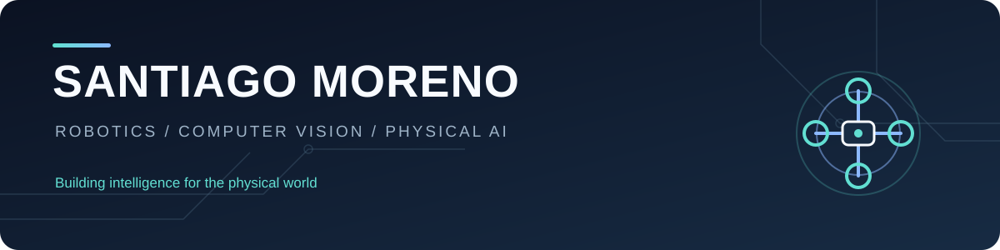

  <h1>Hi, I'm Santiago Moreno Ordóñez 👋</h1>
  
<strong>Robotics Engineer · Computer Vision · Physical AI</strong>

  
I build AI and perception systems that connect software with robots, drones and embedded devices.

  
📍 Seville, Spain &nbsp;·&nbsp; 🔬 Junior Researcher at the Service Robotics Lab

---

### What I work on

My work sits at the intersection of **robotics, computer vision and machine learning**. I enjoy taking a perception or planning idea beyond a notebook and integrating it with sensors, control software and physical platforms.

`Python` · `C++` · `ROS 1/2` · `Computer Vision` · `YOLO` · `Machine Learning` · `Docker` · `Embedded Systems`

### Selected projects

#### 🤖 Expressive motion for the TIAGo robot · NHoA

Developed AI-based methods for transferring emotional expressions to a PAL Robotics TIAGo robot. The research combined generative models, animation workflows and ROS integration to explore more expressive social-robot behavior.

*Private research project · Code is not public*

#### 🚁 Drone-based thermal inspection and geolocation

Built a Python pipeline for analyzing thermal images captured by a DJI drone. It uses YOLO to detect pipeline segments and combines detections with GPS, gimbal angles and altitude to map potential thermal anomalies at solar facilities.

*Private project · Code is not public*

#### 🛸 Crazyflie autonomous navigation

Developed a navigation system for a Crazyflie quadrotor **in Webots simulation**, using 3D A* path planning and PID-based control. A YOLO person detector can trigger a stop during autonomous flight. Built collaboratively.

**[Explore the code →](https://github.com/SantiagoMoreno0123/Crazyflie-Autonomous-Navigation)**

#### 🤟 Sign language detection with YOLOv8

Built a Raspberry Pi prototype that recognizes sign-language gestures from a webcam, displays detected signs on a Sense HAT LED matrix and plays audio through a Bluetooth speaker. Built collaboratively.

**[Explore the code →](https://github.com/SantiagoMoreno0123/Sign-Language-Detection-with-YOLO)**

### Recognition & community

- 🏆 **BiosensorMed — 1st Prize (student category) and Austral Venture Award, XIX Entrepreneurship Ideas Contest, University of Seville (2024).** Member of the winning team. [University announcement](https://stce.us.es/noticias/las-iniciativas-biosensormed-y-easechain-ganan-el-xix-concurso-de-ideas-de-emprendimiento).
- 🎓 **Berkeley Method of Entrepreneurship Bootcamp (UC Berkeley, 2024).** Attended as part of the prize awarded to the BiosensorMed team. [University story](https://www.us.es/actualidad-de-la-us/dos-estudiantes-de-la-us-cursan-el-berkeley-method-entrepreneurship-bootcamp).
- 🧩 **FIRST LEGO League Seville (2024 & 2025).** Technical event staff, helping with setup, on-site support and referee duties.
- 🤝 **ROSCon España 2024, Universidad Pablo de Olavide.** Technical event staff with the Service Robotics Lab, supporting conference setup and on-site operations. [Event announcement](https://www.upo.es/upotec/contenidos/noticias/2024/sep/19/roscon-espana-2024-reunira-la-comunidad-robotica-e/).

### About me

I have a Master's degree in Electronics, Robotics and Automation Engineering from the University of Seville. At the Service Robotics Lab, I work on AI-driven robotics and drone projects, with interests in human–robot interaction, perception and autonomous systems.

If you're building at the intersection of **AI and the physical world**, I'd be glad to connect.

**[GitHub profile](https://github.com/SantiagoMoreno0123)**
